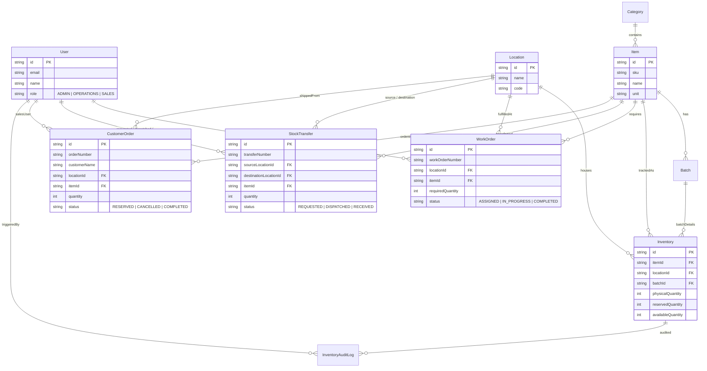

# Mini Operations ERP System

Production-oriented, full-stack **Mini Operations ERP** built as per technical case study specifications. The application handles multi-location inventory management, work orders with dynamic shortage calculation, multi-stage internal stock transfers with double-receipt protection, role-based authorization, and atomic concurrency-safe customer stock reservations.

---

## 🚀 Key Features & Modules

1. **Authentication & Role-Based Authorization**
   - 3 Pre-configured User Roles: `Admin`, `Operations User`, and `Sales User`.
   - JWT authentication (`Bearer token`) with backend-enforced route authorization middleware.
   - Quick 1-click role switcher on the login page for effortless evaluator testing.

2. **Inventory Management Engine**
   - Tracks stock across **Items**, **Categories**, **Locations**, and **Batches**.
   - Formula: `Available Quantity = Physical Quantity - Reserved Quantity`.
   - Backend guardrails preventing negative stock, invalid quantities, or duplicate batch records.

3. **Work Order & Material Stock Check**
   - Admin-exclusive work order creation.
   - Real-time material stock check with dynamic shortage calculation:
     $$\text{Shortage} = \max(0, \text{Required Material} - \text{Available at Location})$$

4. **Internal Stock Transfer Lifecycle**
   - Multi-stage transfer workflow: `REQUESTED` $\rightarrow$ `DISPATCHED` $\rightarrow$ `RECEIVED`.
   - **On Dispatch**: Source physical inventory is immediately reduced.
   - **Before Receipt**: Destination inventory remains unchanged.
   - **On Receipt**: Destination inventory increases.
   - **Double-Receipt Guard**: Backend rejects duplicate receipt calls.

5. **Customer Order & Concurrency-Safe Stock Reservation**
   - Sales users reserve inventory for customer orders.
   - **Concurrency Control**: Database transactions with atomic update criteria (`WHERE availableQuantity >= requiredQuantity`) prevent race conditions when two users reserve stock simultaneously beyond physical limits.
   - Includes order cancellation releasing reserved inventory.

---

## 🛠️ Tech Stack

- **Backend**: Node.js, Express, TypeScript, Prisma ORM, Swagger UI (`swagger-ui-express`), Vitest, Supertest.
- **Frontend**: React, Vite, TypeScript, Tailwind CSS, Lucide Icons, Axios, React Router.
- **Database**: SQLite (via Prisma) by default for zero-config execution; fully compatible with PostgreSQL via `.env`.
- **Testing**: Vitest integration test suite for mandatory business logic rules.

---

## 📊 Database ER Diagram



---

## 🔧 Project Setup & Execution Guide

### Prerequisites
- Node.js (v18 or v20+)
- npm or yarn

### 1. Environment Setup

Check `backend/.env`:
```env
PORT=5000
DATABASE_URL="file:./dev.db"
JWT_SECRET="super-secret-mini-erp-key-2026"
NODE_ENV="development"
```

### 2. Backend Setup & Database Seeding

Open terminal in `backend` directory:
```bash
cd backend
npm install
npx prisma db push
npx ts-node prisma/seed.ts
npm run dev
```
The backend API server will start at `http://localhost:5000`.

### 3. Interactive API Documentation (Swagger)

Visit: **`http://localhost:5000/api-docs`** to explore and test endpoints directly via Swagger UI.

### 4. Frontend Setup

Open terminal in `frontend` directory:
```bash
cd frontend
npm install
npm run dev
```
The React frontend application will launch at `http://localhost:3000`.

---

## 🧪 Running Mandatory Automated Tests

To execute the Vitest integration test suite covering all mandatory requirements:

```bash
cd backend
npm test
```

### Test Case Verification Matrix

| Test Case | Requirement Description | Status |
| :--- | :--- | :--- |
| **Test 1** | Cannot reserve more than available inventory | ✅ **PASSED** |
| **Test 2** | Cannot transfer more than available inventory | ✅ **PASSED** |
| **Test 3** | Destination stock increases ONLY after transfer receipt | ✅ **PASSED** |
| **Test 4** | Same transfer cannot be received twice | ✅ **PASSED** |
| **Test 5** | Unauthorized user cannot perform restricted operation | ✅ **PASSED** |

---

## 🔑 Demo Login Credentials

For quick evaluation, click the quick-login role buttons on the login page or use:

| Role | Email | Password | Allowed Operations |
| :--- | :--- | :--- | :--- |
| **Admin** | `admin@erp.com` | `password123` | Full access, Work Order creation, Stock transfers |
| **Operations** | `ops@erp.com` | `password123` | Inventory management, Stock adjustments, Transfers |
| **Sales User** | `sales@erp.com` | `password123` | Customer Order creation, Stock reservations |

---

## 📹 Demo Video Walkthrough Script (5–7 Minutes)

When recording your demo video, follow this exact sequence:

1. **Login & Role Authorization (1 min)**:
   - Log in as **Sales User** and show restricted options (e.g. Work Order creation blocked).
   - Switch to **Admin** using the quick login button.
2. **Inventory Dashboard (1 min)**:
   - Explain Physical vs. Reserved vs. Available calculation (`Available = 100 - 0 = 100`).
   - Demonstrate stock adjustment with reason logging.
3. **Work Order & Shortage Calculation (1.5 min)**:
   - Create a Work Order for Factory Beta needing 60 Steel Sheets (where available is only 20).
   - Highlight the automatic shortage calculation: `Shortage = 40 (Stock Required)`.
4. **Internal Stock Transfer (1.5 min)**:
   - Create transfer request of 40 units from Warehouse Alpha to Factory Beta.
   - Click **Dispatch** $\rightarrow$ Show Warehouse Alpha stock drops from 100 to 60 (Destination stock remains 20).
   - Click **Receive Stock** $\rightarrow$ Show Factory Beta stock increases to 60.
   - Attempt to click Receive again $\rightarrow$ Demonstrate double-receipt error protection!
5. **Customer Order & Concurrency Reservation (1 min)**:
   - Log in as **Sales User**, create Customer Order for 50 units.
   - Show Reserved stock increasing to 50 and Available stock dropping.
   - Attempt to reserve 100 units when only 10 are available $\rightarrow$ Demonstrate atomic rejection!
